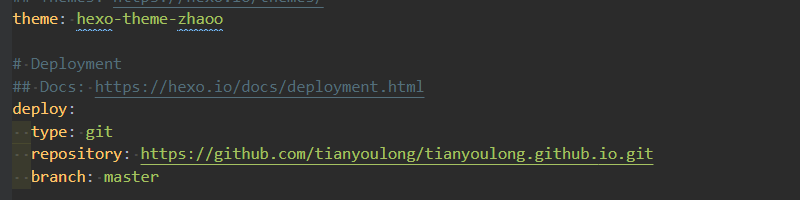

Hexo 是一款基于 Node.js 的静态博客框架，通过它生成的静态网页可以托管在 GitHub 上。整个搭建过程非常简单，同时博客主题风格比较多，易于配置使用。大家可以进入[hexo 官网](http://hexo.io)查看使用教程,因为第一次使用 hexo 框架，在使用过程中有遇到一些问题,做个记录。

网站整个部署过程可以分为 2 个部分， 分别是 hexo 安装和部署到 github 上

## 安装 Git

登录到[Git 官网](https://git-scm.com/),选择适合电脑的版本下载，整个过程比较简单，下载好后直接 next 一步到位

## 安装 node

登录到[node 官网](https://nodejs.org/en/download/),选择最新稳定版本下载安装,安装成功之后，先通过 node -V 查询安装结果 ，出来版本号信息， 说明安装成功。如果需要修改包路径，可以在网上搜索修改方法

## 安装淘宝镜像

npm 在国内下载包会比较慢，所以很多时候我们都会选择安装淘宝镜像，具体的方法非常简单，在安装配置好 node 之后，打开 cmd 输入命令:

`npm config set registry https://registry.npm.taobao.org`

## 安装 hexo

`npm install -g hexo-cli`

安装成功之后可以通过 hexo -V 查看当前安装版本，如果展示版本号，说明安装成功

## 使用 hexo 创建一个项目

在 G 盘的 workspace 中新建一个目录 hexo,使用编辑器打开这个文件夹，在命令行中输入一下命令初始化一个 hexo 项目

`hexo init blog`

`cd blog`

`npm install`

安装完成之后，我们会看到在 blog 文件夹下又一下这几个目录：

- node_modules:依赖包

- public :存放生成的页面

- scaffolds:生成文章的一些模板

- source:用来存放写的文章

- themes: 存放主题文件

- \_config.yml:配置文件

`hexo clean` //清除缓存文件 会将 public 文件夹删除

`hexo g` //发表草稿

`hexo server` //启动项目

`hexo d` // 上传到 GitHub 或者其他的托管平台

`hexo new [filename]` //创建新的文章页面

## GitHub 上创建个人仓库

如果没有 GitHub 账号的话，可以到[GitHub 官网](https://github.io)上注册一个账号,注册成功之后,登录到 GitHub,在右上角的加号中，找到 new repository，新建一个仓库,仓库名使用用户名就好， 这样在部署到 GitHub page 的时候，才会被识别.设置好仓库名称之后，点击 create repository 就可以了,仓库就创建好了

## GitHub 上生成 SSH 添加到 GitHub

在电脑 G 盘，新建一个空文件夹， 使用 Git Bash 打开，输入一下命令

`git config --global user.name "yourName"`

`git config --global user.email "email"`

yourName 表示的是 GitHub 的用户名，Email 表示的是 GitHub 的邮箱

`git config user.name`

`git config user.email`

通过这两个命令可以检查当前输入的用户名和邮箱是否正确，最后创建 SSH

`ssh-keygen -t rsa -C "email"`

在电脑 C 盘中只要到一个.ssh 的文件夹,打开之后会发现又两个文件，分别是 id_rsa 和 id_rsa.pub,其中 id_rsa 属于私人密钥，id_rsa.pub 属于公共密钥。打开 id_rsa.pub 文件夹，复制其中的内容之后， 打开 GitHub。右上角图标点开，找到 setting》SSH and GPG keys 选择 New SSH key,将刚才复制的内容粘贴到文本框中，点击 add 按钮就成功了.当然我们也可以验证，时候成功，在 Git Bash 中输入一下命令

`ssh -T git@github.com`

## 将 hexo 文件部署到 GitHub

我们打开 blog 文件夹下的\_config.yml，下滑到最底部我们可以看到一行代码 deploy

设置好地址之后，需要先安装一个插件 deploy-git 用来把项目部署到 GitHub 上
`npm install hexo-deployer-git --save`

然后输入

`hexo clean`

`hexo g` #这个是 hexo generate 的缩写

`hexo deploy` #缩写 hexo d

这样就把项目部署到 GitHub 上了,然后我们也可以通过之前设置的 GitHub 上的那个地址来访问写的博客 'yourname.github.io'

## 使用过程中遇到的一些坑

1.不同电脑上怎么实现不同地方都可以上传,而且保持数据跟新，
答:只要在 config,yml 中设置的 GitHub 地址是一样的，在上传新的文章之前， 可以先把 GitHub 上的资源 clone 到本地，然后再上传

2.当前主题的图片怎么设置？
答:当前主题存在多个位置又图片，欢迎页面，导航页面，进入详情之后的顶部都有图片，其中欢迎页面，导航页面的图片可以把图片放到对应主题下 image 文件夹下，再在文章页面通过`image:image/tupian.jpg`的方式引入就行
